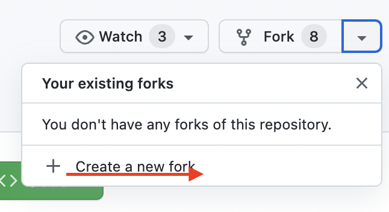
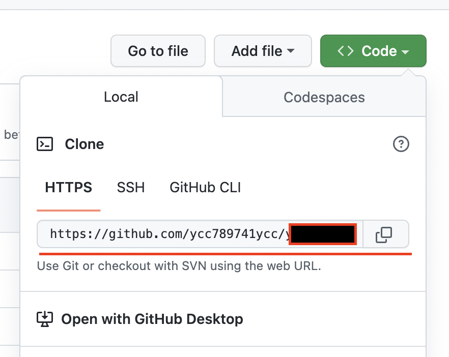
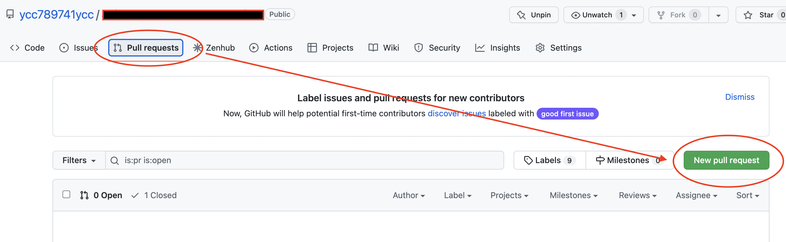

# Topic
[JPX Tokyo Stock Exchange Prediction](https://www.kaggle.com/competitions/jpx-tokyo-stock-exchange-prediction/data)  

# Goal
To achieve the Kaggle topic and share the result base on personal understanding.  

# Framework
> Data processing
* The codding process you handle for the raw data.
* How you handle for the missing value or skew dataset and why?
> EDA
* Data visualization
* What you observe after the data exploration in your comprehension?
> Feature Engineering
* After finishing the EDA, what's the next step you performing the feature transform?
> Model Selection
* How to decide the baseline model?
* Which performance metrics would you pick for model evaluation and why?
> Model training
* Conduct the training process on the model you selected.
> Evaluate On Testing Environment
* Evaluate you model on the testing dataset

# How to work with this repository?
* Step 1: Fork this repository to your personal repository  
  
  
* Step 2: Go to your forked repository and copy the url  
  
  
* Step 3: Clone the forked repository you the url you just copied  
```bash
git clone <COPIED_URL>
```  
> Start your work under the directory `JPX_Tokyo_Stock_Exchange_Prediction`  
* Step 1: Copy the `template.ipynb`  
* Step 2: Rename the file to your github user name  
* Step 3: Try to work around, feel free to make the edition on the markdown cell :D.  

> After you finish the work you done  
* Step 1: Make commit on your local repository  
```bash
git add ./JPX_Tokyo_Stock_Exchange_Prediction/<YOUR_IPYNB>
git commit -m "<COMMIT MESSAGE WHAT EVER YOU WANT>"
```  
`NOTE: DON'T COMMIT THE DATASET OR BINARY FILE TO THE REPOSITORY!!`  
  
* Step 2: Push to your personal github repository from your local  
```bash
git push origin
```  
* Step 3: Make Pull Request from your forked repository to source repository  
    - Go to the source repository  
  

# Discussion Time Line  
After 2 weeks, 12/3 (temporary)  
